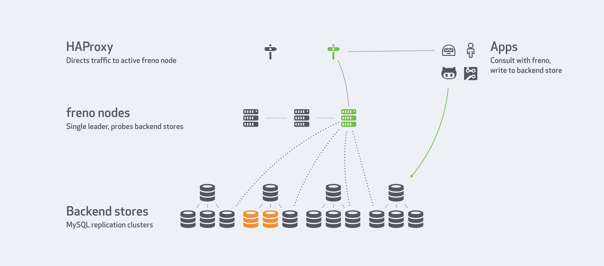

# Deployment

Consider this suggested deployment:

Cross reference with [high availability](high-availability.md) docs:

- `3` or `5` `freno` nodes form a `freno` highly available service
- One of them is elected leader, and it is the only node to:
  - Continuously probe backend stores
  - Serve `/check` queries
- `HAProxy` service directs all traffic to the single active node
- Clients consult with `freno` via `HAProxy`. They will implicitly connect to the leader node.
- Based on `freno`'s response they will either write or refrain from writing to backend stores.
